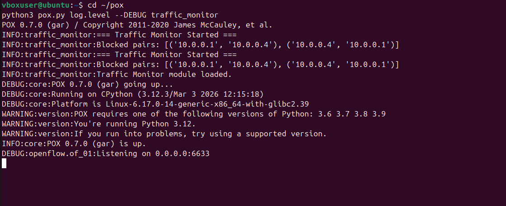
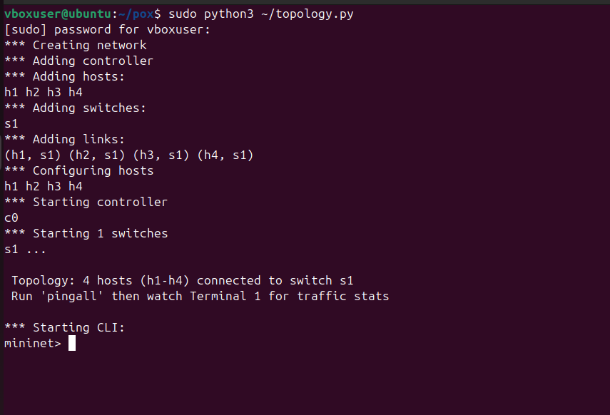
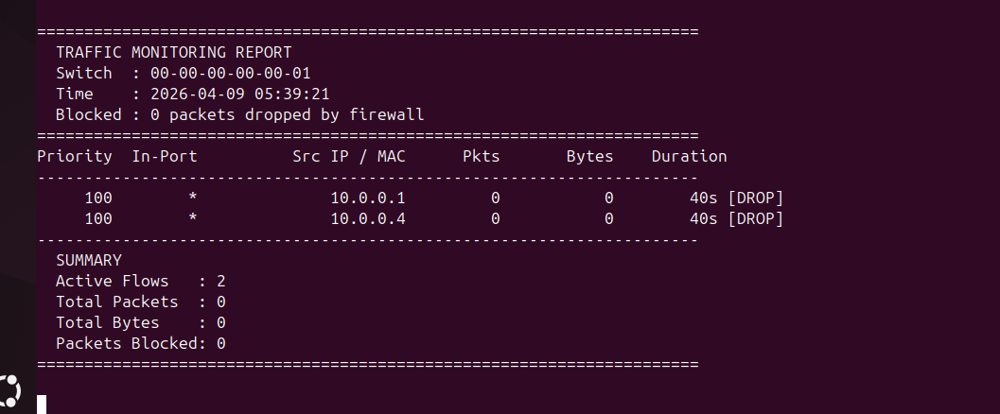
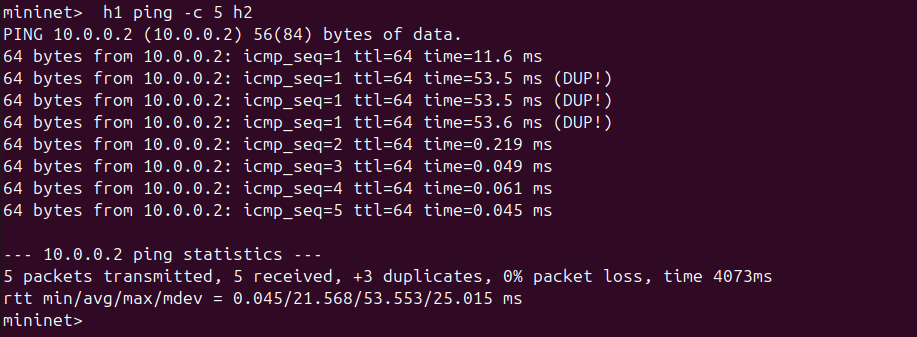
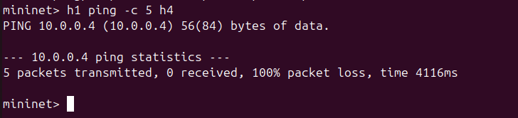
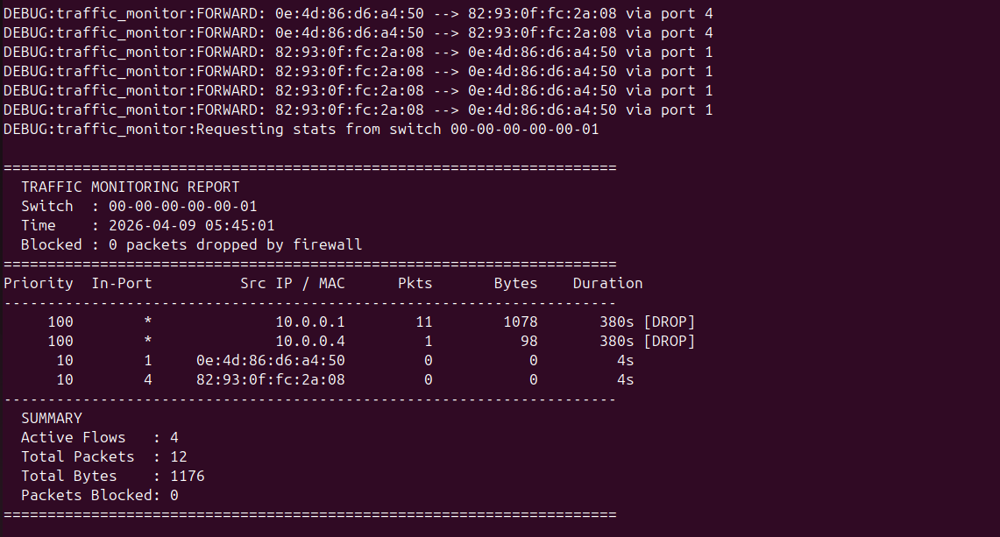
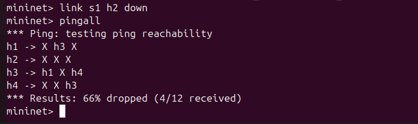
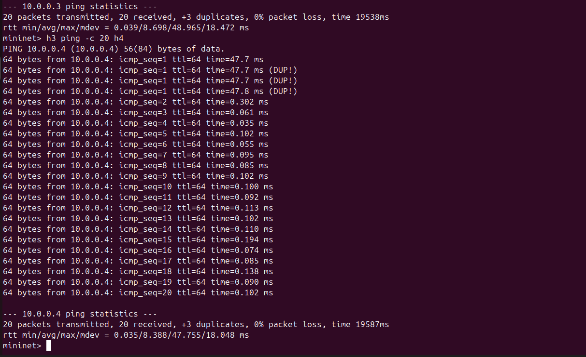
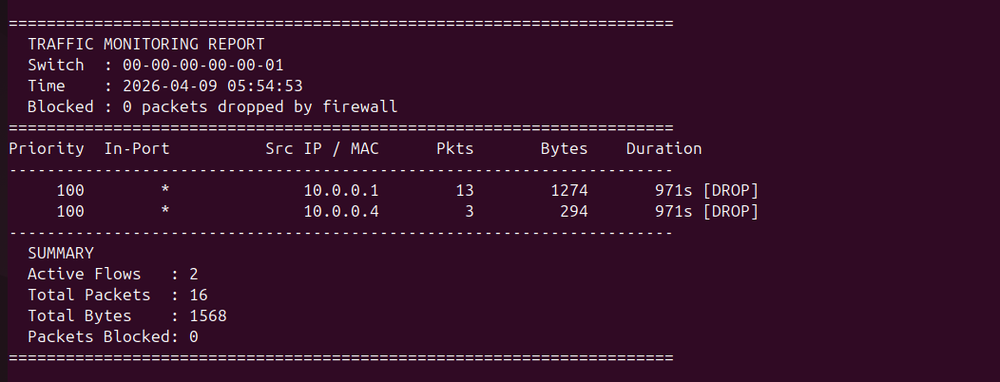
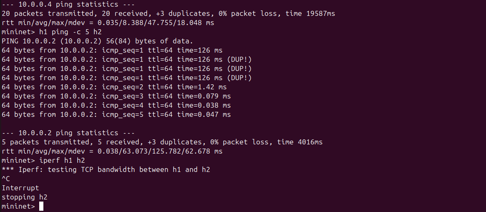

# Traffic Monitoring and Statistics Collector
### SDN Project | UE24CS252B – Computer Networks | PES University

---

## Problem Statement

Build an SDN controller module using **Mininet** and **POX** that collects and displays real-time network traffic statistics. The controller retrieves flow-level data from OpenFlow switches, displays packet and byte counts per flow, performs periodic monitoring, generates simple traffic summary reports, and enforces firewall rules to block specific traffic.

---

## Objectives

- Implement a **learning switch** using POX controller with OpenFlow 1.0
- Enforce **firewall/blocking rules** — h1 ↔ h4 traffic is blocked
- Retrieve and display **flow statistics** (packet count, byte count, duration)
- **Poll traffic data** periodically every 10 seconds
- Generate human-readable **traffic summary reports**
- Demonstrate **link failure and recovery** behavior

---

## Tools & Technologies

| Tool | Purpose |
|------|---------|
| Mininet | Network topology emulation |
| POX | OpenFlow SDN controller (Python) |
| Open vSwitch (OVS) | Software switch with OpenFlow support |
| OpenFlow 1.0 | Controller–switch communication protocol |
| `ovs-ofctl` | CLI tool to inspect flow tables |
| `iperf` | Network throughput testing |
| `ping` / `pingall` | Connectivity and latency testing |

---

## Network Topology

```
  h1 (10.0.0.1)
        |
  h2 (10.0.0.2) ---[s1: OVS Switch]--- POX Controller (port 6633)
        |
  h3 (10.0.0.3)
        |
  h4 (10.0.0.4)

  FIREWALL RULE: h1 <--> h4 is BLOCKED
```

- **1 Switch** (s1) connected to **4 Hosts** (h1–h4)
- Controller listens on `127.0.0.1:6633`
- h1 ↔ h4 communication is blocked by DROP rules installed at startup

---

## Project Structure

```
traffic-monitor/
├── traffic_monitor.py    ← POX controller (place in pox/ext/)
├── topology.py           ← Mininet custom topology
└── README.md
```

---

## Setup & Execution

### Prerequisites

- Ubuntu 20.04 / 22.04 (VM or native)
- Python 3
- Mininet installed
- POX cloned

### Step 1 – Install Mininet

```bash
sudo apt update && sudo apt upgrade -y
sudo apt install mininet -y
```

### Step 2 – Clone POX

```bash
cd ~
git clone https://github.com/noxrepo/pox
```

### Step 3 – Add Controller File

```bash
cp traffic_monitor.py ~/pox/ext/
```

### Step 4 – Kill any existing controller on port 6633

```bash
sudo fuser -k 6633/tcp
sudo mn -c
```

### Step 5 – Start POX Controller (Terminal 1)

```bash
cd ~/pox
python3 pox.py log.level --DEBUG traffic_monitor
```

### Step 6 – Start Mininet Topology (Terminal 2)

```bash
sudo python3 ~/topology.py
```

---

## Proof of Execution — Screenshots

---

### 📸 Screenshot 1 — POX Controller Startup
**Terminal 1** | After running `python3 pox.py log.level --DEBUG traffic_monitor`

Shows the controller loading successfully with Traffic Monitor module loaded and POX listening on port 6633.



---

### 📸 Screenshot 2 — Mininet Topology Launch
**Terminal 2** | After running `sudo python3 topology.py`

Shows hosts h1–h4 and switch s1 being added, controller connecting, and `mininet>` CLI prompt ready.



---

### 📸 Screenshot 3 — Switch Connected + Firewall Rules Installed
**Terminal 1** | Appears automatically after topology starts — nothing to type

Shows:
- `Switch connected: 00-00-00-00-00-01`
- `FIREWALL: DROP rule installed 10.0.0.1 --> 10.0.0.4`
- `FIREWALL: DROP rule installed 10.0.0.4 --> 10.0.0.1`



---

## Test Scenario 1 — Allowed vs Blocked (Firewall)

---

### 📸 Screenshot 4 — Allowed Traffic (h1 → h2)
**Terminal 2** | Run:
```bash
mininet> h1 ping -c 5 h2
```
Shows ping **succeeding** with 0% packet loss — h1 to h2 is allowed.



---

### 📸 Screenshot 5 — Blocked Traffic (h1 → h4)
**Terminal 2** | Run:
```bash
mininet> h1 ping -c 5 h4
```
Shows ping **failing** with 100% packet loss — h1 to h4 is blocked by the firewall DROP rule.



---

### 📸 Screenshot 6 — Firewall Block Log in Controller
**Terminal 1** | Appears automatically after attempting h1 → h4 ping — nothing to type

Shows the WARNING log:
```
WARNING:traffic_monitor:FIREWALL: BLOCKED packet  10.0.0.1 --> 10.0.0.4
```



---

### 📸 Screenshot 7 — Flow Table Showing DROP Rules
**Terminal 2** | Run:
```bash
mininet> sh ovs-ofctl dump-flows s1
```
Shows high priority (100) DROP rules for h1 ↔ h4 and lower priority (10) forwarding rules for all allowed pairs.


---

## Test Scenario 2 — Normal vs Link Failure

---

### 📸 Screenshot 8 — Normal State (All Hosts Reachable)
**Terminal 2** | Run:
```bash
mininet> pingall
```
Shows all hosts successfully communicating (h1 ↔ h4 fails due to firewall, all others pass).


---

### 📸 Screenshot 9 — Link Failure (h2 goes down)
**Terminal 2** | Run:
```bash
mininet> link s1 h2 down
mininet> pingall
```
Shows h2 is now **unreachable** — all pings to/from h2 fail with 100% packet loss.



---

### 📸 Screenshot 10 — Flow Table After Failure
**Terminal 2** | Run:
```bash
mininet> sh ovs-ofctl dump-flows s1
```
Shows flow rules for h2 have **timed out and disappeared** from the switch flow table.


---

### 📸 Screenshot 11 — Link Recovery
**Terminal 2** | Run:
```bash
mininet> link s1 h2 up
mininet> pingall
```
Shows h2 is **reachable again** after the link is restored — full recovery demonstrated.


---

## Traffic Monitoring — Statistics Report

---

### 📸 Screenshot 12 — Generate Traffic for Stats
**Terminal 2** | Run:
```bash
mininet> h1 ping -c 30 h2
mininet> h2 ping -c 20 h3
mininet> h3 ping -c 20 h4
```
Generates traffic across multiple host pairs so the stats report shows real numbers.



---

### 📸 Screenshot 13 — Traffic Statistics Report ⭐ Most Important
**Terminal 1** | Appears **automatically** every 10 seconds — nothing to type

Shows the full traffic report including per-flow packet/byte counts, flow duration, DROP rules marked with `[DROP]`, and the summary section.



---

### 📸 Screenshot 14 — iperf Throughput Test
**Terminal 2** | Run:
```bash
mininet> h1 ping -c 5 h2
mininet> iperf h1 h2
```
*(Run ping first to ensure flows are installed before iperf)*

Shows bandwidth measurement between h1 and h2 in Gbits/sec.



---

## Expected Output Summary

### Firewall Behavior
| Pair | Expected Result |
|------|----------------|
| h1 → h2 | ✅ Allowed |
| h1 → h3 | ✅ Allowed |
| h2 → h3 | ✅ Allowed |
| h2 → h4 | ✅ Allowed |
| h3 → h4 | ✅ Allowed |
| h1 → h4 | ❌ Blocked (DROP rule) |
| h4 → h1 | ❌ Blocked (DROP rule) |

### Traffic Report Sample
```
======================================================================
  TRAFFIC MONITORING REPORT
  Switch  : 00-00-00-00-00-01
  Time    : 2025-01-10 14:23:05
  Blocked : 5 packets dropped by firewall
======================================================================
Priority  In-Port      Src IP / MAC      Pkts       Bytes    Duration
----------------------------------------------------------------------
     100        *         10.0.0.1          0           0        45s [DROP]
     100        *         10.0.0.4          0           0        45s [DROP]
      10        1   aa:bb:cc:00:00:01       42        4200       30s
      10        2   aa:bb:cc:00:00:02       40        4000       28s
----------------------------------------------------------------------
  SUMMARY
  Active Flows   : 4
  Total Packets  : 82
  Total Bytes    : 8200
  Packets Blocked: 5
======================================================================
```

---

## Screenshot Checklist

| # | What | Terminal | Command to run |
|---|------|----------|---------------|
| 1 | POX startup | Terminal 1 | `python3 pox.py log.level --DEBUG traffic_monitor` |
| 2 | Mininet launch | Terminal 2 | `sudo python3 topology.py` |
| 3 | Switch connected + firewall rules | Terminal 1 | Nothing — auto appears |
| 4 | Allowed ping h1→h2 | Terminal 2 | `h1 ping -c 5 h2` |
| 5 | Blocked ping h1→h4 | Terminal 2 | `h1 ping -c 5 h4` |
| 6 | Firewall WARNING log | Terminal 1 | Nothing — auto appears |
| 7 | Flow table with DROP rules | Terminal 2 | `sh ovs-ofctl dump-flows s1` |
| 8 | Normal pingall | Terminal 2 | `pingall` |
| 9 | pingall after link down | Terminal 2 | `link s1 h2 down` then `pingall` |
| 10 | Flow table after failure | Terminal 2 | `sh ovs-ofctl dump-flows s1` |
| 11 | pingall after link recovery | Terminal 2 | `link s1 h2 up` then `pingall` |
| 12 | Generate traffic | Terminal 2 | `h1 ping -c 30 h2` etc. |
| 13 ⭐ | Traffic stats report | Terminal 1 | Nothing — auto appears after 10s |
| 14 | iperf result | Terminal 2 | `iperf h1 h2` |

---

## Cleanup

```bash
# Inside Mininet CLI
mininet> exit

# Remove leftover state
sudo mn -c
```

---

## Design Justification

**Why single switch topology?**
Simple and sufficient to demonstrate all SDN concepts — forwarding, blocking, and monitoring — without unnecessary complexity.

**Why POX?**
POX is lightweight, Python-based, and directly supports OpenFlow 1.0 which is what OVS uses in Mininet by default.

**Why block h1 ↔ h4?**
Demonstrates a real-world SDN use case — isolating specific hosts using flow rules instead of physical hardware firewalls.

**Why periodic stats polling?**
Simulates real network monitoring systems that collect telemetry at regular intervals for analysis and reporting.

---

## References

1. Mininet Documentation – https://mininet.org/overview/
2. Mininet Walkthrough – https://mininet.org/walkthrough/
3. POX Controller Wiki – https://github.com/noxrepo/pox/wiki
4. OpenFlow 1.0 Specification – https://opennetworking.org/wp-content/uploads/2013/04/openflow-spec-v1.0.0.pdf
5. OVS Flow Inspection – http://www.openvswitch.org/support/dist-docs/ovs-ofctl.8.txt
6. GitHub – Mininet – https://github.com/mininet/mininet
